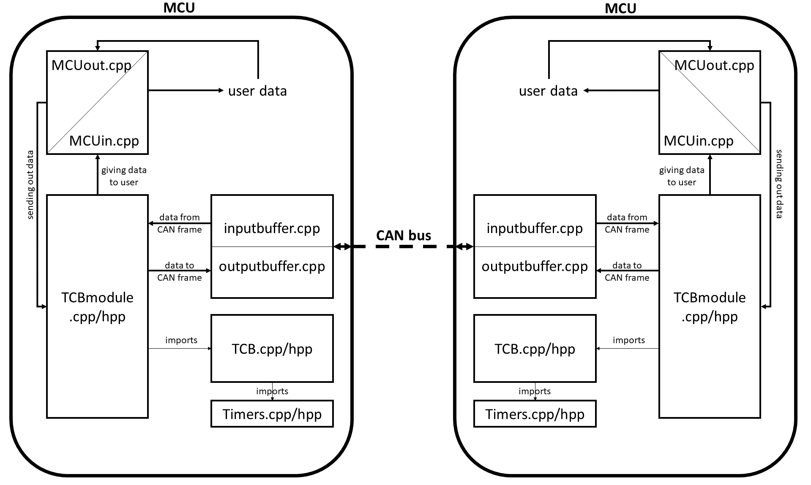

Module layout
=================

The below figure shows the internal structure of an MCU's communication, and the roles that each portion of source code plays in the system.

Functions
=================

Below are basic explanations of each function in the source code by file group. (Singular files are explained under the section entitled *Other files*.

Aware files
^^^^^^^^^^^

* *<constructor>* - setting of the class object variables according to which connection it represents
* *<destructor>* - deletes the connection information from the awareness algorithm's vector
* *calcAvgs* - calculates the average value for each data set, and then passes the data on to the *decide function*
* *decide* - determines the type of behavior observed from the data provided by *calcAvgs*, and creates a tmp file with the related connection information
* *getSets* - adds a new data value to an awareness set in the class object, and records the time of the creation of a new data set
* *sameToID* - returns whether or not a supplied character matches the destination ID in the Aware object
* *sameFromID* - same as *sameToID*, but with the sender ID

TCB files
^^^^^^^^^

TCBmodule files
^^^^^^^^^^^^^^^

Timer files
^^^^^^^^^^^
* *<constructor>* - setting of the class object variables by type
* *<destructor>* - defined but empty
* *isExpired* - checks to see if the timer value for the Timer object has expired based on the type of timer it is
* *reset* - resets the timer value

Other files
=================

* *CANinterface.sh* - establishes a single virtual CAN bus network interface
* *CANmult.sh* - establishes two virtual CAN bus network interfaces for MitM testing
* *keyGen.cpp* - creates a symmetric 256-bit AES to be pre-shared among all devices on the network
* *inputbuffer.cpp* - the data-link layer interface that receives messages on the CAN bus that match its assigned ID, and runs parallel to the TCB module
* *Makefile* - builds the source code and generates the executables required to run BetterCAN
* *MCUin.cpp* - part of the application layer for the MCU, where messages are simply read in after being parsed
* *MCUout.cpp* - part of the application layer for the MCU, where the transport and session layer parsers are established
* *outputbuffer.cpp* - the data-link layer interface that sends messages on the CAN bus to a specific destination ID, which is only ran when there is a message to send
* *SSMaware.cpp* - creates and manages a vector of connections for the awareness algorithm
* *SSMstack.cpp/hpp* - creates and manages the data stack where connection data is stored for parsing in the event of a network breach