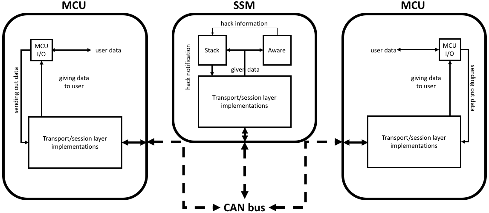

Introduction
===================

This page briefly introduces BetterCAN and how it works.

What is BetterCAN?
^^^^^^^^^^^^^^^^^^

BetterCAN is a update on the controller area network (CAN) bus standard to increase the overall security of the network and all the devices on it. From a structural standpoint according to the OSI model, the CAN bus network is based on the physical, data link, and application layers. This structure allows the CAN bus to send messages at almost real-time speeds. However, there are no protections built into this protocol, which can allows any external threat to easily hijack the network and control the devices connected to it.

BetterCAN introduces a transport and session layer to the network, based on TCP and TLS protocols. Thanks to the introduction of these features, it becomes much harder for external threats to intercept, inject, or alter any messages being sent on the network.

How does it work [in a nutshell]?
^^^^^^^^^^^^^^^^^^^^^^^^^^^^^^^^^

BetterCAN is an expansion of the CAN protocol according to the OSI network. 

There are three devices that are involved in sending a message. A sending device (MCU1) transmits a message to a third-party watchdog (signal security module, or SSM), which archives the data being sent without decrypting it. The SSM then sends the message to the destination device (MCU2), which replies with an ACK containing information that the SSM could use to determine if any message data was somehow compromised either from the end device or during transmission over the network.

The below diagram shows the general flow of the network:

All three devices parse incoming messages according to implemented transport and session layers, the latter of which utilizes 256-bit AES block ciphers to encrypt the contents of the session and application layers.

The SSM, in addition to parsing capabilities, runs two additional processes. One process stores [encrypted] data in a stack format (stack) and the other stores metadata of passed data and uses an awareness algorithm to detect any potentially suspicious or malignant activity (aware). In the event of a successful network breach, the SSM uses the awareness algorithm to determine unusual behavior, then terminate the connection while transmitting previous valid data values to the victim if needed.

For more detailed and technical information, please consult the :download:`master's thesis <MT.pdf>` that this project was based on.

Where can BetterCAN be applied?
^^^^^^^^^^^^^^^^^^^^^^^^^^^^^^^

Although BetterCAN is still only a proof-of-concept, it has the potential to fully implemented onto existing CAN hardware, therefore eliminating the need for major hardware-based infrastructure upgrades.

BetterCAN was developed with the needs of the automotive industry in mind. It seeks to address the need for mission-critical speed and reliability while adding a much-needed layer of security. However, just about any security implementation comes at a performance cost. This performance cost can be partially adjusted by the system engineer, especially with respect to the awareness algorithm.

Of course, BetterCAN can be expanded outside the automotive industry. Because CAN is a simpler network than Ethernet, it can be used for many other applications, including but not limited to:

* fixed appliances, including medical devices and internal communications for Internet-of-things (IoT) devices
* other forms of transportation, such as trains and airplanes
* local networking hardware configurations, such as network routers

BetterCAN is an open source project, which means that anyone can apply BetterCAN for their own purposes in whichever field they work in that uses the CAN bus.